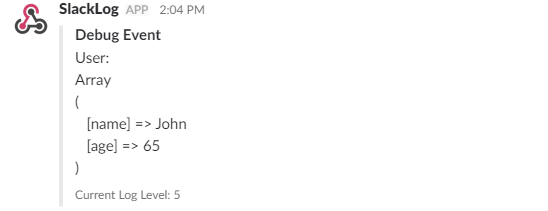

# Laravel Slack Log

[](https://packagist.org/packages/smcrow/laravel-slack-log) [](https://packagist.org/packages/smcrow/laravel-slack-log) [](https://packagist.org/packages/smcrow/laravel-slack-log) [](https://travis-ci.org/cr0wst/laravel-slack-log) 

This package utilizes Laravel's native ability to create slack notifications to log at different log levels.  This was inspired by Log4j.

## Log Levels
There are several different log levels that can be used.  The desired level of logging is defined in the config.

Here are some example uses of the different log levels:
* `ERROR` - Indicates that an error occured.
* `WARN` - Indicates that an error occured but it was recoverable.
* `INFO` - Informational message usually explaining something in a *business rule* sense.
* `TRACE` - Used for reporting where, in the code, the execution is taking place.  Could report entering and leaving functions.
* `DEBUG` - Used for dumping the contents of a variable.

Each message is implemented in the same way. The log levels are for you, the developer, to decide how to use.

The configured log level is checked before the message is sent.  Levels are inclusive in that a specific level will include all message levels above it.  For example, `INFO` will include `INFO`, `WARN`, and `ERROR`.

In some cases, it can be non-trivial to generate the message string.  Logging guards have been provided to assist with this.

# Installation Steps
## Install Through Composer
```
composer require smcrow/laravel-slack-log
```

## Register the Service Provider

### Laravel 5.5
Laravel 5.5 allows for the auto-discovery of service providers.  The `SlackLogServiceProvider` will automatically be discovered.

### Pre Laravel 5.5
You'll need to register the command in order for it to be usable.  Modify the `register` method of `AppServiceProvider`:
```php
public function register()
{
    $this->app->register(SlackLogServiceProvider::class);
}
```

## Registering the Facade
You can register the optional facade by adding the following to your `app.php` aliases:
```php
'SlackLog' => \Smcrow\SlackLog\Facades\SlackLog::class
```

## Configuration
Use `php artisan vendor:publish` to create a new configuration file.  The file will be `config/slack-log.php`.

In this file you will need to provide the webhook url.  I recommend reading [Slack Incoming Webhooks](https://my.slack.com/services/new/incoming-webhook/) for more information on how to setup the webhook.

# Example Usage
With logging guards and using the facade:

```php
$user = ['name' => 'John', 'age' => 65];

if (SlackLog::isDebugEnabled()) {
    SlackLog::debug('User: ' . print_r($user, true));
}
```
Produces the following:


# Feedback and Contributions
Please feel free to offer suggestions by submitting an Issue.  Alternatively, submit a pull request with any features you wish to add.  This is a work-in-progress, and I would welcome any and all feedback.